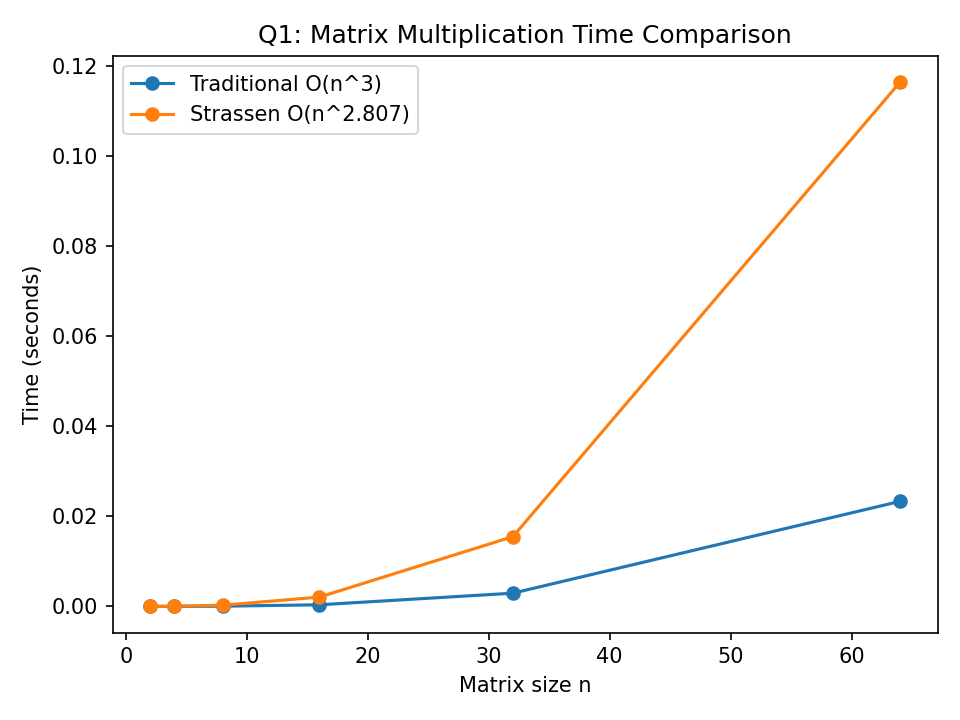
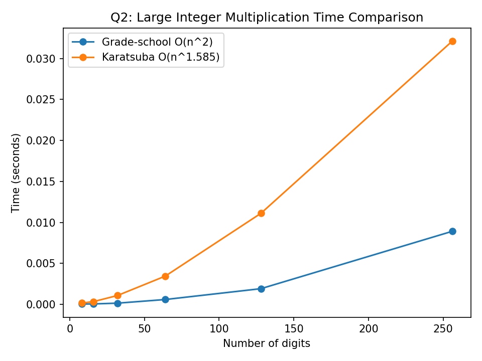
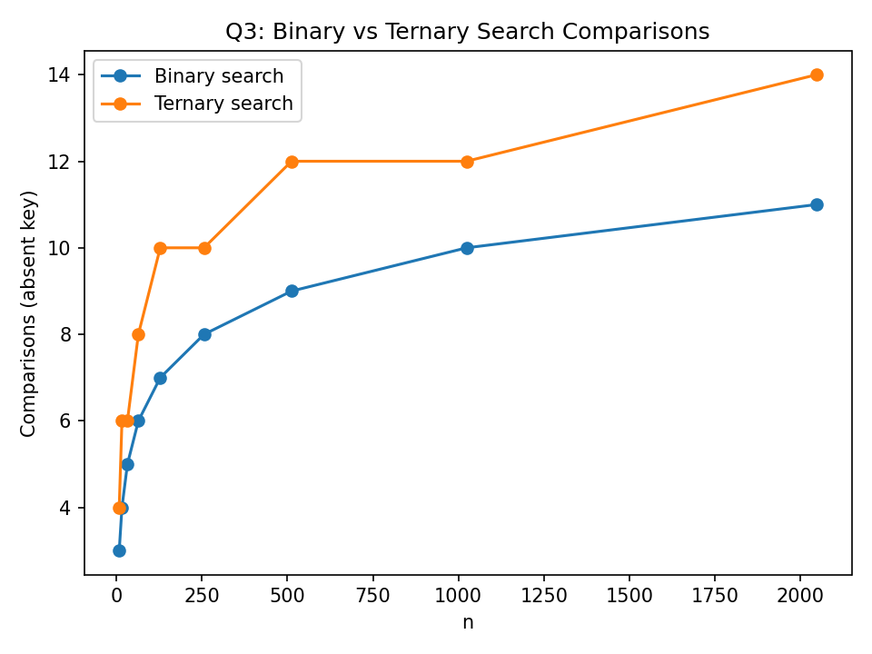

# Q1: Matrix Multiplication — Traditional vs Strassen

## Objective

Multiply two square matrices using:

1. Traditional matrix multiplication
2. Strassen's matrix multiplication

## Test Results

| n | Traditional (seconds) | Strassen (seconds) | Match |
|---:|---:|---:|:---:|
| 2 | 0.000002 | 0.000002 | True |
| 4 | 0.000007 | 0.000032 | True |
| 8 | 0.000045 | 0.000258 | True |
| 16 | 0.000355 | 0.002067 | True |
| 32 | 0.002934 | 0.015497 | True |
| 64 | 0.023333 | 0.116459 | True |

## Screenshot / Graph

## Result

The `Match` column is `True` for all test sizes. This means both algorithms produced the same matrix result.

For these small test sizes, Traditional multiplication was faster because Strassen has extra recursion and matrix-addition overhead.

## Short Reflection

I learned that Strassen can reduce the number of multiplications by using a divide-and-conquer method. I also learned that an algorithm with better time complexity is not always faster for small inputs because it can have extra overhead.

---

# Q2: Karatsuba vs Grade-School Multiplication

## Objective

Multiply large integers using:

1. Grade-school multiplication
2. Karatsuba's algorithm

## Test Results

| Digits | Grade-school (seconds) | Karatsuba (seconds) | Match |
|---:|---:|---:|:---:|
| 8 | 0.000032 | 0.000148 | True |
| 16 | 0.000045 | 0.000329 | True |
| 32 | 0.000138 | 0.001072 | True |
| 64 | 0.000583 | 0.003441 | True |
| 128 | 0.001907 | 0.011106 | True |
| 256 | 0.008908 | 0.032117 | True |

## Screenshot / Graph

## Result

The `Match` column is `True` for all test sizes. This means both algorithms produced the same multiplication result.

For these test sizes, Grade-school multiplication was faster because Karatsuba has extra recursive overhead. Karatsuba becomes more useful as the number of digits becomes much larger.

## Short Reflection

I learned how Karatsuba reduces four multiplications to three. At first the recursive code looked difficult, but I understood that it divides a large number into smaller parts and combines the results. This helped me understand why divide and conquer can improve an algorithm.

---

# Q3: Binary Search vs Ternary Search

## Objective

Search for a key in a sorted array using:

1. Binary Search
2. Ternary Search

## Test Results

The following results are for an **absent key**, so the search continues until the algorithm finishes.

| n | Binary comparisons | Ternary comparisons |
|---:|---:|---:|
| 8 | 3 | 4 |
| 16 | 4 | 6 |
| 32 | 5 | 6 |
| 64 | 6 | 8 |
| 128 | 7 | 10 |
| 256 | 8 | 10 |
| 512 | 9 | 12 |
| 1024 | 10 | 12 |
| 2048 | 11 | 14 |

## Screenshot / Graph

## Result

Both Binary Search and Ternary Search have `O(log n)` complexity.

The number of comparisons is different because Ternary Search checks two middle positions in each iteration, while Binary Search normally checks one middle position.

## Short Reflection

I learned that both searches are fast because they reduce the search area after every step. I also learned that having the same Big-O complexity does not mean both algorithms make the same number of comparisons.

---

